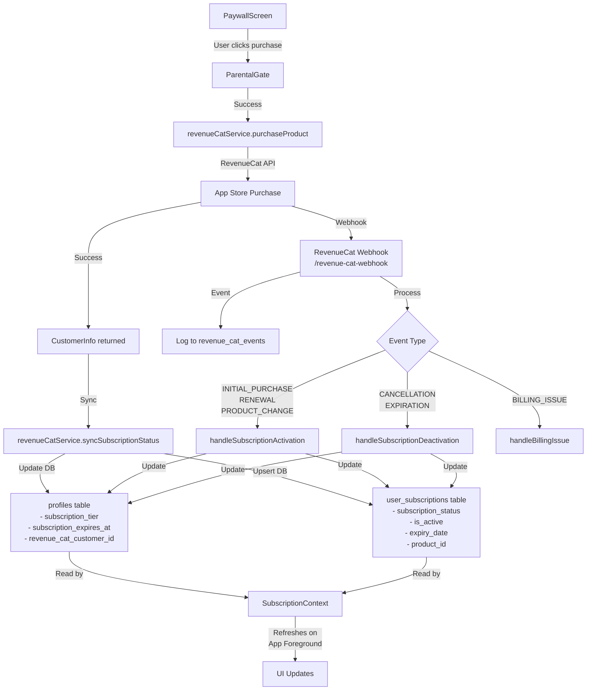

# Subscription Flow Analysis

## Overview

Your subscription system is properly set up with both client-side and webhook-based updates. Here's how everything connects:

## Flow Diagram



## ✅ What's Working Well

### 1. **Dual Update System**
- **Client-side**: Immediate updates via `revenueCatService.syncSubscriptionStatus()` after purchase
- **Server-side**: Webhook handles all subscription lifecycle events (renewals, cancellations, etc.)
- Both update the same tables ensuring consistency

### 2. **Proper Error Handling**
- RevenueCat service has retry logic with exponential backoff
- Webhook logs all events to `revenue_cat_events` table
- Detailed error logging for debugging

### 3. **Database Structure**
- Two tables for redundancy: `profiles` (quick access) and `user_subscriptions` (detailed info)
- Proper columns for tracking subscription state:
  - `subscription_tier` / `subscription_status`
  - `subscription_expires_at` / `expiry_date`
  - `is_active` flag
  - `environment` and `store` fields (added via migration)

### 4. **Auto-refresh Mechanism**
- SubscriptionContext refreshes when app comes to foreground
- This catches any webhook updates that happened while app was backgrounded

## 🎯 Key Integration Points

### PaywallScreen → RevenueCat
```typescript
// Product IDs match what's configured in RevenueCat
const productId = selectedPlan === 'monthly' 
  ? 'com.saylekxd.Tailyapp.Monthly' 
  : 'com.saylekxd.Tailyapp.Annual';
```

### RevenueCat → Database (Client-side)
```typescript
// In revenueCatService.syncSubscriptionStatus()
// Updates both profiles and user_subscriptions tables
```

### RevenueCat → Database (Webhook)
```typescript
// Webhook handles these events:
- INITIAL_PURCHASE → Sets premium status
- RENEWAL → Maintains premium status
- CANCELLATION/EXPIRATION → Reverts to free
- BILLING_ISSUE → Sets billing_issue status
```

## ⚠️ Potential Issues to Watch

### 1. **User ID Consistency**
- Ensure RevenueCat is always logged in with the Supabase user ID
- The webhook expects `app_user_id` to match Supabase user ID

### 2. **Timing Issues**
- Manual DB updates might be overwritten by webhooks
- Solution: Your auto-refresh on app foreground handles this

### 3. **Webhook Reliability**
- Make sure your Supabase Edge Function URL is correctly configured in RevenueCat dashboard
- Check Supabase logs if webhooks aren't arriving

## 🔧 Testing Checklist

1. **Purchase Flow**
   - [ ] ParentalGate appears and functions correctly
   - [ ] Purchase completes successfully
   - [ ] Database updates immediately (both tables)
   - [ ] UI reflects premium status without app restart

2. **Webhook Processing**
   - [ ] Check `revenue_cat_events` table for logged events
   - [ ] Verify subscription tables update correctly
   - [ ] Test renewal events (sandbox environment)
   - [ ] Test cancellation events

3. **Edge Cases**
   - [ ] Network failures during purchase
   - [ ] App killed during purchase
   - [ ] Restore purchases functionality
   - [ ] Subscription expiry handling

## 📝 Webhook Configuration

Make sure your RevenueCat webhook is configured with:
- URL: `https://[your-project-id].supabase.co/functions/v1/revenue-cat-webhook`
- Events: All events enabled
- Authentication: None needed (webhook validates internally)

## 🚀 Everything Looks Good!

Your subscription system is well-architected with:
- Redundant update mechanisms (client + webhook)
- Proper error handling and retry logic
- Automatic UI refresh on app foreground
- Comprehensive event logging

The manual database update issue you experienced is handled by the auto-refresh mechanism in SubscriptionContext. 